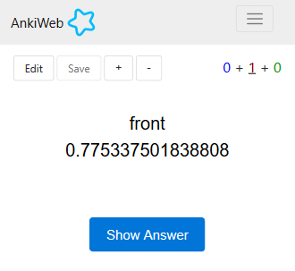
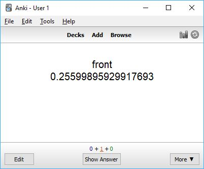
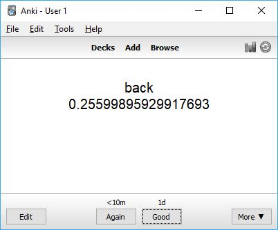
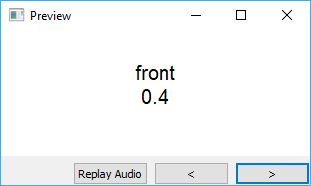
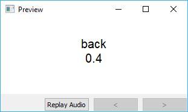
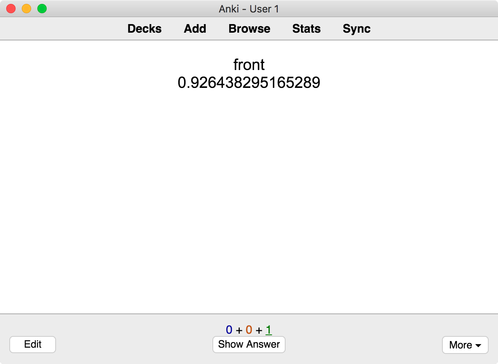
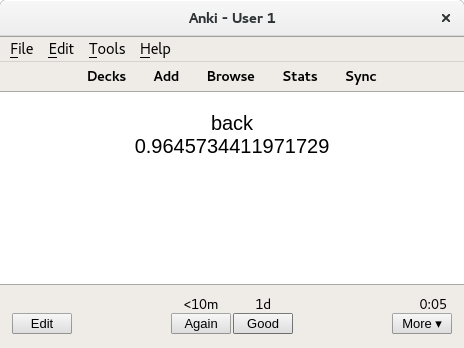

# anki-persistence
Persist data between both sides of an anki flashcard.

## Example: Random number

This example shows how anki-persistence can be used to display the same random number on both sides of an Anki flash card. **All of these images depict the same note!** You can try it out yourself with [this exported Anki deck](examples/random-number/anki-persistence.apkg).

### Result
| Client                 | Front | Back |
| ----------------------:|:-----:|:----:|
|                    Web |  |  |
|                Windows |  |  |
| Windows (card preview) |  |  |
|                Android |  |  |
| Android (card preview) |  |  |
|                    Mac |  |  |
|     Mac (card preview) |  |  |
|                  Linux |  |  |
|     Linux (card preview) |  |  |

TODO: Test iOS

**Note that Persistence is not available for Windows card preview (```Persistence.isAvailable()``` returns ```false```), thus a default (0.4) is chosen.**

### Setup
#### Front side
~~~html
<script>
// v0.2.1 - https://github.com/SimonLammer/anki-persistence/blob/8a3648baa02a9cd5c1f51e5adf3772dd5d494757/script.js
"undefined"===typeof window.Persistence&&(window.Persistence=new function(){var a=!1;try{"object"===typeof window.sessionStorage&&(a=!0,this.store=function(a){sessionStorage.setItem("github.com/SimonLammer/anki-persistence",JSON.stringify(a))},this.load=function(){return JSON.parse(sessionStorage.getItem("github.com/SimonLammer/anki-persistence"))})}catch(e){}for(var d=["py","qt"],b=0;!a&&b<d.length;b++){var c=window[d[b]];"object"===typeof c&&(a=!0,this.store=function(a){c["github.com/SimonLammer/anki-persistence"]=
a},this.load=function(){return c["github.com/SimonLammer/anki-persistence"]||null})}this.isAvailable=function(){return a}});
</script>

{{Front}}

<div id="front"></div>

<script>
var number = 0.4;
if (Persistence.isAvailable()) {
  number = Persistence.load();
  if (number == null) {
    number = Math.random();
    Persistence.store(number);
  }
}
window.front.appendChild(document.createTextNode(number));
</script>
~~~

#### Back side

~~~html
<script>
// v0.2.1 - https://github.com/SimonLammer/anki-persistence/blob/8a3648baa02a9cd5c1f51e5adf3772dd5d494757/script.js
"undefined"===typeof window.Persistence&&(window.Persistence=new function(){var a=!1;try{"object"===typeof window.sessionStorage&&(a=!0,this.store=function(a){sessionStorage.setItem("github.com/SimonLammer/anki-persistence",JSON.stringify(a))},this.load=function(){return JSON.parse(sessionStorage.getItem("github.com/SimonLammer/anki-persistence"))})}catch(e){}for(var d=["py","qt"],b=0;!a&&b<d.length;b++){var c=window[d[b]];"object"===typeof c&&(a=!0,this.store=function(a){c["github.com/SimonLammer/anki-persistence"]=
a},this.load=function(){return c["github.com/SimonLammer/anki-persistence"]||null})}this.isAvailable=function(){return a}});
</script>

{{Back}}

<div id="back"></dv>

<script>
var number = 0.4;
if (Persistence.isAvailable()) {
  number = Persistence.load();
  Persistence.store(null);
}
window.back.appendChild(document.createTextNode(number));
</script>
~~~

#### Note

The note has two fields: ```Front``` and ```Back```.
These are set to ```front``` and ```back``` respectively.

## Preparation

TODO: Add screenshots

To use anki-persistense, follow these steps:
1. Download the script from [the latest release](releases/latest). We recommend using the minified version (```minified.js```) to save space in the anki card type.
1. Copy and paste the file contents between to the beginning of front and back side of the card type.
1. Ensure that both script blocks are enclosed in ```<script>``` and ```</script>```.

## Usage

Anki clients vary in their implementation and JavaScript can behave differently in each one. Therefore, check for availability before using other Persistence methods.

~~~javascript
if (Persistence.isAvailable()) {
	// do stuff
}
~~~

Other methods:

|                       Name    | Description |
| -----------------------------:|:----------- |
| ```Persistence.store(data)``` | Persists the data, so it can be retrieved later. |
|      ```Persistence.load()``` | Retrieves previously stored data. If no data has been stored yet, null is returned. |

*Some implementations of Persistence may use JSON.stringify and JSON.parse in the process of persisting and retrieving data.*

### Clear storage

```Persistence.store``` may persist data across cards, this should be stopped by calling ```Persistence.store(null)``` at the end of the backside. (If this gets called on the frontside's beginning instead, you cannot use anki's ```{{FrontSide}}``` special field in the backside *- because this would delete the persisted data*)

# Acknowledgements

Huge thanks to

* [RunasSudo, whose code kick-started this project](https://yingtongli.me/blog/2015/03/15/random-question-generator-on-anki-using.html)!
* [u/CheCheDaWaff for providing test information and screenshots of the woking random number example on the **mac** client](https://www.reddit.com/r/Anki/comments/8ksjqb/pass_data_between_both_sides_of_an_anki_flashcard/dzbpfdd/)
* [u/qwiglydee for providing test information and screenshots of the working random number example on the **linux** client](https://www.reddit.com/r/Anki/comments/8ksjqb/pass_data_between_both_sides_of_an_anki_flashcard/dzbpnbm/)


## Other references

* [r/Anki - Passings state between Fields](https://www.reddit.com/r/Anki/comments/4mhfmm/passing_state_between_fields/)
* [r/Anki - Pass data between both sides of an Anki flashcard](https://www.reddit.com/r/Anki/comments/8ksjqb/pass_data_between_both_sides_of_an_anki_flashcard/)